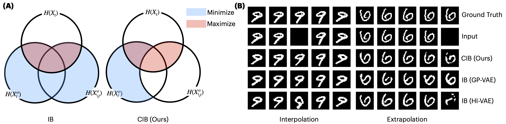

# TimeCIB
This is an official repository of TimeCIB: Clinical Time Series Imputation using Conditional Information Bottleneck, presented at [ICLR24](https://openreview.net/forum?id=K1mcPiDdOJ) and [NeurIPS23 DGM4H Workshop](https://sites.google.com/ethz.ch/dgm4h-neurips2023).

TimeCIB defines time-series imputation as an information-theoretic perspective. Along with this viewpoint, we found that direct application of Information Bottleneck (IB) framework such as VAE to time series data without considering temporal context can lead to a substantial loss of temporal dependencies, especially on interpolation or extrapolation. To address such a challenge, we propose a novel conditional information bottleneck (CIB) approach for time series imputation, which aims to mitigate the potentially negative consequences of the regularization constraint by reducing the redundant information conditioned on the temporal context.

## Citations
If you use this code or the models in your research, please cite the following paper:

    @inproceedings{choi2024conditional,
        title={{Conditional Information Bottleneck Approach for Time Series Imputation}},
        author={MinGyu Choi and Changhee Lee},
        booktitle={The Twelfth International Conference on Learning Representations},
        year={2024}
    }

## QuickStart
First clone the repo `git clone https://github.com/Chemgyu/TimeCIB.git`

We also use [wandb](https://wandb.ai/site) to track training: setup wandb account.

## Data Preparation
Download data to `./data` using the following scripts: `bash data/load_{hmnist, physionet}.sh`. This will download five missing patterns of hmnist data, and physionet data.

Code for rotatedMNIST will be provided soon.

Preprocess data using the following scripts: `python preprocess/preprocess_{hmnist, physionet}.sh`. This will preprocess each dataset, and generate missing_ratio experiments included in the manuscript.

## Reproduce the TimeCIB

### Train
To train your model, use the following:
- Retrain on the HMNIST: `python train.py --d hmnist --pn hmnist-TimeCIB --rn reproduce --m timecib --b 0.1 --l 0.5 --clen 1.0 --p norm --ep 40 --dim 128 --imputed forward`

- Retrain on the Physionet: `python train.py --d physionet --pn physionet-TimeCIB --rn reproduce --m timecib --b 0.001 --l 0.001 --clen 32 --p norm  --ep 50 --dim 16 --imputed forward`

### Evaluation
To test your model, use the following.
- Test on the HMNIST: `python train.py --d hmnist --pn hmnist-TimeCIB --rn reproduce --m timecib --b 0.1 --l 0.5 --clen 1.0 --p norm --ep 40 --dim 128 --imputed forward --dir {path_to_the_model} --test True`

- Test on the Physioinet: `python train.py --d physionet --pn physionet-TimeCIB --rn reproduce --m timecib --b 0.001 --l 0.001 --clen 32 --p norm  --ep 50 --dim 16 --imputed forward --dir {path_to_the_model} --test True`

### Baselines
You can also train/test baseline models (GP-VAE, HI-VAE, VAE). 

For example, `python train.py --d physionet --pn physionet-Baselines --rn reproduce --m {gpvae, hivae, vae} --b 0.001 --l 0.001 --clen 32 --p {norm, gp}  --ep 50 --dim 16` 

Make sure to use `--p gp` for GP-VAE.